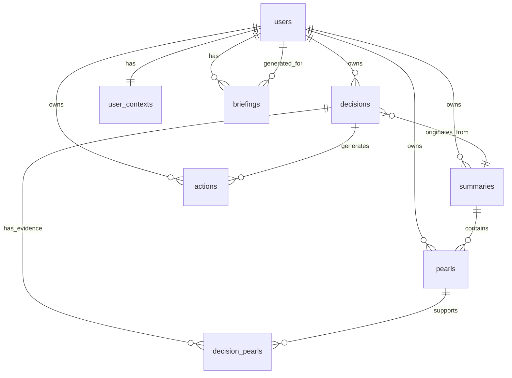

# Cedar Essence — Personal Strategic Intelligence

Transform Context Keeper from a meeting summary tool into a personal strategic intelligence system. The product accumulates context from meetings, notes, and observations and builds a compounding picture of your strategic landscape through a Briefing + Dashboard home view.

## Overview

Cedar Essence extends the existing summary + pearls pipeline with three new capabilities:

1. **Decision surfacing** — AI generates testable hypotheses from pearl evidence
2. **Action generation** — Concrete next steps with full lineage (pearl quote → decision → framing)
3. **Cross-seed intelligence** — Connecting dots across multiple inputs, evolving decision confidence
4. **Briefing + Dashboard** — AI-written narrative ("what matters now") + structured strategic view

The accumulated intelligence IS the product. Individual summaries are input, not output.

## Problem Statement

After generating a meeting summary, users have no bridge from "I understand what happened" to "I know what to do about it." Insights evaporate. Decisions stay implicit. Actions lack context. And nothing connects across meetings — each summary is an island.

Cedar Essence closes this gap: evidence → understanding → decision → action, compounding over time.

## Architecture Decisions (from SpecFlow analysis)

These resolve the critical questions that block implementation:

### D1: Home page structure

`/dashboard` becomes the Briefing + Dashboard. The existing summary list becomes a "Seeds" section within the dashboard (tab or collapsible section). Logged-in users land on the briefing view. The existing `DashboardClient.tsx` is refactored, not replaced.

### D2: Briefing generation

**Event-triggered + cached.** Briefing regenerates after each new input is processed (including pearl curation). Cached in a `briefings` table. On dashboard load, serve the cached briefing. Manual "refresh" button available. Context window: all active decisions, last 30 pearls by recency, user context, summary of recurring themes.

### D3: Cross-seed confidence updates

After pearl curation on a new input, run a cross-seed query (concept overlap + speaker matching against existing pearls). If matches found, pass them to the AI alongside the relevant decision and request an updated confidence assessment. Surface changes in the next briefing regeneration.

### D4: Decision data model

Keep `origin_summary_id` (nullable) to track where a decision was first surfaced. The `decision_pearls` junction table links pearls from ANY summary — this is the cross-seed evidence chain. A decision's "home" is its origin, but its evidence spans sources.

### D5: Persistent user context

Optional settings page accessible from nav. First input works without context. After the first summary, show a gentle prompt: "Set your role and priorities to make Cedar smarter." Context auto-applies to all AI calls when set.

### D6: Quick note entry point

Collapsible input at the top of the dashboard. Text field with optional dropdowns for "who" (free text), "related decision" (dropdown of active decisions), and concept tags (existing tag chip pattern). Submitting a note enters the same processing pipeline as any other input.

### D7: Guest experience

Guests get the generation flow (summary + pearls + decisions + actions) in memory/localStorage. No briefing, no cross-seed intelligence, no recurring themes — these require accumulation, which requires persistence, which requires sign-up. The guest flow remains "generate and preview, sign up to keep."

### D8: Summary view role

Summary view remains accessible as the "drill into this input" detail page. Decisions and actions surfaced from a specific summary are visible on both the summary detail page AND the dashboard. The summary view is extended, not replaced.

### D9: Post-curation flow

After pearl curation, show "Surface decisions from these pearls" button. Decision generation happens inline (slide-over panel or section below pearls), not on a separate page. This replaces the cut ConstellationPrompt.

### D10: Rate limiting budget

Redesign per-endpoint limits. A single input triggers ~5-8 AI calls (summary + tags + pearls + decisions + 2-3 actions). Per-endpoint limits:

- `/api/summarize`: 10/hour (unchanged)
- `/api/pearls/generate`: 15/hour
- `/api/decisions/generate`: 15/hour
- `/api/actions/generate`: 30/hour (multiple per decision)
- `/api/briefings/generate`: 10/hour

### D11: Cascade delete safety

`decisions.origin_summary_id` is nullable with `SET NULL` on delete (not CASCADE). Deleting a summary does NOT delete its decisions if those decisions have evidence from other sources. `decision_pearls` uses CASCADE — deleting a pearl removes its evidence link, and if a decision loses ALL supporting pearls, the UI flags it as "evidence removed."

---

## Technical Approach

### Data Model



### New Database Tables

```sql
-- User strategic context (persistent lens)
CREATE TABLE user_contexts (
  id UUID PRIMARY KEY DEFAULT gen_random_uuid(),
  user_id UUID NOT NULL UNIQUE REFERENCES auth.users(id) ON DELETE CASCADE,
  role TEXT,                            -- "Engineering Manager"
  priorities TEXT[] DEFAULT '{}',       -- ["Q2 deadline", "Team hiring"]
  key_relationships JSONB DEFAULT '[]', -- [{name, role, notes}]
  custom_context TEXT,                  -- Freeform
  updated_at TIMESTAMPTZ NOT NULL DEFAULT NOW()
);

-- Decisions: living hypotheses grounded in pearl evidence
CREATE TABLE decisions (
  id UUID PRIMARY KEY DEFAULT gen_random_uuid(),
  user_id UUID NOT NULL REFERENCES auth.users(id) ON DELETE CASCADE,
  origin_summary_id UUID REFERENCES summaries(id) ON DELETE SET NULL,
  statement TEXT NOT NULL,
  reasoning TEXT,
  confidence TEXT NOT NULL CHECK (confidence IN ('low', 'medium', 'high')) DEFAULT 'low',
  status TEXT NOT NULL CHECK (status IN ('emerging', 'active', 'resolved', 'revised')) DEFAULT 'emerging',
  created_at TIMESTAMPTZ NOT NULL DEFAULT NOW(),
  updated_at TIMESTAMPTZ NOT NULL DEFAULT NOW()
);

-- Decision-Pearl evidence links (cross-seed capable)
CREATE TABLE decision_pearls (
  decision_id UUID NOT NULL REFERENCES decisions(id) ON DELETE CASCADE,
  pearl_id UUID NOT NULL REFERENCES pearls(id) ON DELETE CASCADE,
  relationship TEXT NOT NULL CHECK (relationship IN ('supports', 'contradicts')),
  PRIMARY KEY (decision_id, pearl_id)
);

-- Actions: concrete next steps with lineage
CREATE TABLE actions (
  id UUID PRIMARY KEY DEFAULT gen_random_uuid(),
  user_id UUID NOT NULL REFERENCES auth.users(id) ON DELETE CASCADE,
  decision_id UUID REFERENCES decisions(id) ON DELETE SET NULL,
  description TEXT NOT NULL,
  context_card JSONB,                   -- {sourcePearlQuote, framing, timing, talkingPoints}
  status TEXT NOT NULL CHECK (status IN ('pending', 'in_progress', 'done')) DEFAULT 'pending',
  due_date TIMESTAMPTZ,
  created_at TIMESTAMPTZ NOT NULL DEFAULT NOW(),
  updated_at TIMESTAMPTZ NOT NULL DEFAULT NOW()
);

-- Cached briefings
CREATE TABLE briefings (
  id UUID PRIMARY KEY DEFAULT gen_random_uuid(),
  user_id UUID NOT NULL REFERENCES auth.users(id) ON DELETE CASCADE,
  markdown TEXT NOT NULL,
  context_snapshot JSONB,               -- {decisionCount, pearlCount, themes}
  generated_at TIMESTAMPTZ NOT NULL DEFAULT NOW()
);
```

All tables get RLS policies (user-only access) and appropriate indexes. See Phase 1 for full migration.

### New TypeScript Interfaces

```typescript
// src/lib/types/cedar.ts

export type DecisionConfidence = 'low' | 'medium' | 'high';
export type DecisionStatus = 'emerging' | 'active' | 'resolved' | 'revised';
export type ActionStatus = 'pending' | 'in_progress' | 'done';

export interface Decision {
  id: string;
  userId: string;
  originSummaryId: string | null;
  statement: string;
  reasoning: string;
  confidence: DecisionConfidence;
  status: DecisionStatus;
  supportingPearls: DecisionPearl[];
  createdAt: string;
  updatedAt: string;
}

export interface DecisionPearl {
  pearlId: string;
  relationship: 'supports' | 'contradicts';
}

export interface ActionContextCard {
  sourcePearlQuote: string;
  sourcePearlSpeaker?: string;
  sourcePearlInsight: string;
  parentDecisionStatement: string;
  framing: string;
  timing?: string;
  talkingPoints?: string[];
}

export interface Action {
  id: string;
  userId: string;
  decisionId: string | null;
  description: string;
  contextCard: ActionContextCard | null;
  status: ActionStatus;
  dueDate: string | null;
  createdAt: string;
  updatedAt: string;
}

export interface UserContext {
  role?: string;
  priorities: string[];
  keyRelationships: { name: string; role?: string; notes?: string }[];
  customContext?: string;
}

export interface Briefing {
  id: string;
  markdown: string;
  contextSnapshot: {
    decisionCount: number;
    pearlCount: number;
    themes: string[];
  };
  generatedAt: string;
}
```

### AI Prompts

Three new prompts added to a new `src/lib/cedar-ai.ts` module, following the existing pattern in `claude.ts` (system prompt + tool definition + forced tool_choice):

1. **Decision surfacing** — Takes pearls + summary + user context. Returns 2-5 hypotheses with pearl references and confidence. Includes "no decisions needed" as valid output.
2. **Action generation** — Takes a decision + its pearls + user context. Returns 1-3 actions with context cards.
3. **Briefing synthesis** — Takes active decisions, recent pearls, recurring themes, user context. Returns a narrative paragraph about what matters now.

**Model selection by task:**

- Decision surfacing → `claude-opus-4-6` (judgment-intensive: must infer implicit decisions, assess confidence honestly, know when "no decisions needed" is correct)
- Briefing synthesis → `claude-opus-4-6` (cross-seed synthesis, narrative coherence, Sage character restraint — the product's crown jewel)
- Action generation → `claude-sonnet-4-20250514` (structured/templated output, Sonnet handles well)

### Component Architecture

```
DashboardPage (refactored /dashboard)
├── BriefingSection
│   ├── BriefingNarrative (AI-written markdown)
│   ├── BriefingRefreshButton
│   └── ColdStartMessage (when < 5 inputs)
├── QuickNoteInput (collapsible)
│   ├── TextArea
│   ├── WhoField (optional, free text)
│   ├── DecisionLinker (optional, dropdown)
│   └── ConceptTags (optional, chip input)
├── DashboardTabs
│   ├── StrategicView (default)
│   │   ├── ActiveDecisionsSection
│   │   │   └── DecisionCard (statement, confidence, evidence, actions)
│   │   │       ├── DecisionCard.Evidence (linked pearls)
│   │   │       ├── DecisionCard.Confidence (badge)
│   │   │       ├── DecisionCard.Controls (accept/edit/resolve/revise)
│   │   │       └── ActionList (nested)
│   │   │           ├── ActionItem (description + status toggle)
│   │   │           │   └── ActionItem.ContextCard (expandable)
│   │   │           └── ActionList.AddButton
│   │   ├── OpenActionsSection (actions without parent view)
│   │   └── RecurringThemesSidebar
│   │       └── ThemeChip (concept + count + recency)
│   └── SeedsView (existing summary list, refactored)
│       └── SummaryListItem (existing pattern)
├── UserContextPrompt (gentle nudge when context not set)
└── EmptyState (0 inputs)

SummaryView (existing, extended)
├── ... (existing summary + pearl curation)
└── DecisionSurfacingSection (NEW, appears after pearl curation)
    ├── SurfaceDecisionsButton
    ├── DecisionGenerationSkeleton (loading)
    └── InlineDecisionReview (accept/edit/dismiss each)
```

### API Routes

| Route                     | Method  | Purpose                                         | Rate Limit |
| ------------------------- | ------- | ----------------------------------------------- | ---------- |
| `/api/decisions/generate` | POST    | AI generates decisions from pearls              | 15/hr      |
| `/api/decisions`          | POST    | Persist accepted decision                       | —          |
| `/api/decisions/[id]`     | PATCH   | Update decision (status, confidence, statement) | —          |
| `/api/actions/generate`   | POST    | AI generates actions from decision              | 30/hr      |
| `/api/actions`            | POST    | Persist action                                  | —          |
| `/api/actions/[id]`       | PATCH   | Update action status                            | —          |
| `/api/briefings/generate` | POST    | Generate/refresh briefing                       | 10/hr      |
| `/api/briefings`          | GET     | Fetch cached briefing                           | —          |
| `/api/user-context`       | GET/PUT | Read/write persistent context                   | —          |
| `/api/cross-seed`         | POST    | Query related pearls/decisions for new evidence | —          |

All AI-calling endpoints use Zod validation. All mutation endpoints require auth. Cross-seed endpoint is internal (called server-side during processing, not exposed to client directly).

### Cross-Seed Intelligence (v1: Structured Queries)

When pearl curation completes on a new input:

```sql
-- Find pearls from OTHER summaries that share concepts with new pearls
SELECT p.*, s.title as summary_title
FROM pearls p
JOIN summaries s ON p.summary_id = s.id
WHERE p.user_id = $1
  AND p.summary_id != $2  -- exclude current summary
  AND p.concepts && $3     -- array overlap with new pearl concepts
ORDER BY p.created_at DESC
LIMIT 20;

-- Find decisions whose supporting pearls share concepts
SELECT DISTINCT d.*
FROM decisions d
JOIN decision_pearls dp ON d.id = dp.decision_id
JOIN pearls p ON dp.pearl_id = p.id
WHERE d.user_id = $1
  AND d.status IN ('emerging', 'active')
  AND p.concepts && $3
ORDER BY d.updated_at DESC;
```

Results are passed to the AI alongside the new pearls for:

- Decision confidence reassessment
- New connection identification for the briefing
- Recurring theme aggregation

---

## Implementation Phases

### Phase 0: Mock Data + Dashboard Shell (see destination first)

Build the dashboard UX populated with realistic mock data. This validates the product shape before wiring the real pipeline.

**Tasks:**

- [ ] **Create Cedar types file** — `src/lib/types/cedar.ts` with all interfaces above
  - `src/lib/types/cedar.ts`

- [ ] **Create mock data fixture** — `src/lib/mock-data.ts` with 3-4 weeks of realistic data:
  - 10-15 summaries (1:1s, standups, strategy sessions, cross-functional)
  - 40-60 pearls across those summaries with overlapping concepts
  - 8-12 decisions at various statuses and confidence levels
  - 15-20 actions in various states
  - A pre-written briefing narrative
  - Recurring themes with frequency counts
  - A user context (engineering manager persona)
  - `src/lib/mock-data.ts`

- [ ] **Build dashboard page shell** — Refactor `/dashboard` to show:
  - Briefing section at top (renders mock briefing markdown)
  - Strategic view tab with decision cards, action list, theme sidebar
  - Seeds view tab with existing summary list (preserve existing functionality)
  - Quick note input (collapsible, wired to mock data for now)
  - Cold start / empty state variants
  - `src/app/dashboard/page.tsx` (modify)
  - `src/app/dashboard/DashboardClient.tsx` (heavy refactor)
  - `src/components/dashboard/BriefingSection.tsx` (new)
  - `src/components/dashboard/DecisionCard.tsx` (new)
  - `src/components/dashboard/ActionItem.tsx` (new)
  - `src/components/dashboard/RecurringThemes.tsx` (new)
  - `src/components/dashboard/QuickNoteInput.tsx` (new)

- [ ] **Review mock dashboard with Anansi** — Pause for visual verification. Briefing + dashboard must feel right before building the pipeline.

**Exit criteria:** Dashboard renders with mock data. Briefing is readable. Decision cards show evidence. Actions expand to context cards. The destination is visible.

### Phase 1: Data Foundation

- [ ] **Create database migration** — All new tables (user_contexts, decisions, decision_pearls, actions, briefings) with RLS policies and indexes
  - `supabase/migrations/YYYYMMDDHHMMSS_cedar_essence.sql`

- [ ] **Create Cedar AI module** — `src/lib/cedar-ai.ts` with:
  - `surfaceDecisions(summary, pearls, context, userContext?)` → 2-5 decisions
  - `generateActions(decision, pearls, context, userContext?)` → 1-3 actions
  - `generateBriefing(decisions, recentPearls, themes, userContext?)` → markdown
  - All using Anthropic SDK with tool definitions, matching `claude.ts` patterns
  - `src/lib/cedar-ai.ts`

- [ ] **Run migration locally** — `supabase db reset` to apply all migrations (including new Cedar tables) against local Supabase. All development and testing runs against local DB — no remote Supabase changes until ready for deploy.

**Exit criteria:** Types compile. Migration runs. AI module exports callable functions (not yet wired to routes).

### Phase 2: Decision + Action Pipeline

Wire decisions and actions into the existing flow.

- [ ] **Decision generation endpoint** — `POST /api/decisions/generate`
  - Zod validation, rate limited (15/hr), returns AI-generated decisions
  - `src/app/api/decisions/generate/route.ts`

- [ ] **Decision CRUD endpoints** — `POST /api/decisions` + `PATCH /api/decisions/[id]`
  - Auth required, validates state transitions
  - `src/app/api/decisions/route.ts`
  - `src/app/api/decisions/[id]/route.ts`

- [ ] **Action generation endpoint** — `POST /api/actions/generate`
  - Zod validation, rate limited (30/hr)
  - `src/app/api/actions/generate/route.ts`

- [ ] **Action CRUD endpoints** — `POST /api/actions` + `PATCH /api/actions/[id]`
  - Auth required, validates state transitions
  - `src/app/api/actions/route.ts`
  - `src/app/api/actions/[id]/route.ts`

- [ ] **Post-curation decision surfacing UI** — In SummaryView, after pearl curation:
  - "Surface decisions from N pearls" button
  - Loading skeleton during generation
  - Inline decision review: accept/edit/dismiss each
  - Accepted decisions persist to DB
  - "Generate actions" button per accepted decision
  - Action review with expandable context cards
  - `src/components/DecisionSurfacing.tsx` (new)
  - `src/components/SummaryView.tsx` (modify — add section after pearls)

- [ ] **Guest localStorage persistence** — Save/load decisions and actions to localStorage for guests
  - `src/lib/cedar-storage.ts`

**Exit criteria:** Full loop works: generate summary → curate pearls → surface decisions → accept → generate actions. Persists for logged-in users, localStorage for guests.

### Phase 3: Dashboard + Briefing (Wire Real Data)

Replace mock data with real data and build the briefing.

- [ ] **Briefing generation endpoint** — `POST /api/briefings/generate`
  - Queries: active decisions, recent 30 pearls, theme aggregation, user context
  - Calls `generateBriefing()` from cedar-ai.ts
  - Caches result in briefings table
  - `src/app/api/briefings/generate/route.ts`

- [ ] **Briefing fetch endpoint** — `GET /api/briefings`
  - Returns most recent cached briefing
  - `src/app/api/briefings/route.ts`

- [ ] **Wire dashboard to real data** — Replace mock data imports with API calls:
  - Briefing section fetches from `/api/briefings`
  - Decision cards fetch from Supabase (with pearl joins)
  - Action list fetches from Supabase
  - Recurring themes computed from pearl concept aggregation
  - `src/app/dashboard/DashboardClient.tsx` (modify)

- [ ] **Trigger briefing regeneration** — After a new input completes pearl curation:
  - Auto-trigger `POST /api/briefings/generate` in the background
  - Dashboard shows "Briefing updated" indicator on next visit
  - Manual "Refresh briefing" button always available

- [ ] **Navigation updates** — Update NavBar:
  - "Dashboard" link now goes to briefing + strategic view
  - Add "Settings" for user context (Phase 5)
  - Breadcrumbs: Dashboard → Summary Detail
  - `src/components/NavBar.tsx` (modify)

**Exit criteria:** Dashboard shows real user data. Briefing generates from accumulated evidence. Navigation works between dashboard and summary detail.

### Phase 4: Cross-Seed Intelligence

The "compounding" that makes Cedar different.

- [ ] **Cross-seed query module** — `src/lib/cross-seed.ts`
  - `findRelatedPearls(userId, summaryId, concepts)` — pearls from other summaries with concept overlap
  - `findRelatedDecisions(userId, concepts)` — active decisions with evidence sharing concepts
  - `aggregateThemes(userId)` — concept frequency/recency across all pearls
  - `src/lib/cross-seed.ts`

- [ ] **Wire cross-seed into pearl curation flow** — After pearls are curated:
  - Run cross-seed queries
  - If related decisions found → pass to AI for confidence reassessment
  - If confidence changes → update decision, flag in next briefing
  - Show user: "This evidence relates to your decision about [X]" prompt
  - `src/app/api/pearls/route.ts` (modify — add cross-seed after save)

- [ ] **Wire cross-seed into briefing** — Briefing prompt receives:
  - Theme aggregation results
  - Recent cross-seed connections
  - Decision confidence changes since last briefing
  - `src/lib/cedar-ai.ts` (modify briefing prompt)

- [ ] **Dashboard theme sidebar** — Wire RecurringThemes component to real aggregation:
  - Click a theme → filtered view of pearls with that concept
  - Show frequency and recency
  - `src/components/dashboard/RecurringThemes.tsx` (modify)

**Exit criteria:** New evidence updates existing decision confidence. Briefing reflects cross-seed connections. Themes aggregate across inputs.

### Phase 5: Quick Note + User Context

- [ ] **User context endpoints** — `GET/PUT /api/user-context`
  - Zod validation, auth required
  - `src/app/api/user-context/route.ts`

- [ ] **User context settings page** — Simple form: role, priorities, key relationships, custom context
  - Accessible from nav → Settings
  - `src/app/settings/page.tsx`
  - `src/components/UserContextForm.tsx`

- [ ] **Wire user context into AI calls** — When user context exists, include it in:
  - Summary generation system prompt
  - Pearl extraction system prompt
  - Decision surfacing system prompt
  - Action generation system prompt
  - Briefing generation system prompt
  - `src/lib/claude.ts` (modify — accept optional userContext)
  - `src/lib/cedar-ai.ts` (modify — accept optional userContext)

- [ ] **Quick note processing** — When submitted from dashboard:
  - Enters same pipeline: summarize → pearls → decisions → actions
  - Optional "who" field pre-populates speaker context
  - Optional "related decision" auto-links pearls to that decision
  - `src/app/api/notes/route.ts` (new — thin wrapper around summarize pipeline)

- [ ] **User context prompt** — After first summary, show gentle nudge:
  - "Set your role and priorities to make Cedar smarter"
  - Dismissable, shows again after 3rd summary if still not set
  - `src/components/dashboard/UserContextPrompt.tsx`

**Exit criteria:** User context persists and applies to all AI calls. Quick notes enter the pipeline from the dashboard. Context prompt appears at the right time.

### Phase 6: Polish + Verification

- [ ] **Cold start experience** — Verify the ramp works:
  - 0 inputs: empty state with CTA
  - 1 input: summary + decisions, no briefing, "add more evidence" message
  - 2-3 inputs: lightweight briefing with basic connections
  - 5+ inputs: full briefing
  - Verify transitions feel natural

- [ ] **Decision lifecycle** — Verify all state transitions work:
  - emerging → active (accept)
  - active → resolved (resolve)
  - active → revised (user revises)
  - resolved → revised (reopen)
  - Verify invalid transitions are rejected

- [ ] **Guest experience** — Verify:
  - Decisions and actions work in localStorage
  - No briefing/cross-seed for guests
  - "Sign up to save" prompts appear at right moments
  - Sign-up migrates guest data to DB

- [ ] **Build verification** — `pnpm build` passes. Existing Playwright tests pass. No regressions.

- [ ] **Prompt quality** — Test AI outputs with real transcripts:
  - Decision surfacing produces specific, testable hypotheses (not platitudes)
  - Action context cards are genuinely useful (not generic)
  - Briefing reads naturally and surfaces real connections
  - "No decisions needed" fires when appropriate

---

## Acceptance Criteria

### Functional Requirements

- [ ] After pearl curation, user can surface 2-5 decisions grounded in pearl evidence
- [ ] Each decision shows: hypothesis statement, reasoning, supporting/contradicting pearls, confidence level
- [ ] User can accept, edit, or dismiss each decision
- [ ] For accepted decisions, user can generate 1-3 actions with context cards
- [ ] Context cards show: source pearl quote, parent decision, framing, timing, talking points
- [ ] Dashboard shows AI-written briefing at top, active decisions + open actions below
- [ ] Briefing updates after new evidence is processed
- [ ] Cross-seed intelligence detects when new evidence relates to existing decisions
- [ ] Decision confidence updates as evidence accumulates
- [ ] Recurring themes aggregate across all inputs
- [ ] Quick note input feeds the same processing pipeline
- [ ] Persistent user context applies to all AI calls
- [ ] Guest flow works with localStorage (no briefing/cross-seed)

### Non-Functional Requirements

- [ ] Dashboard loads in < 2s with 50+ pearls and 10+ decisions
- [ ] Briefing generation completes in < 15s
- [ ] Decision surfacing completes in < 10s
- [ ] No regressions in existing summary generation flow
- [ ] All new tables have RLS policies enforcing user-only access
- [ ] Rate limits prevent abuse without blocking normal usage

### Quality Gates

- [ ] `pnpm build` passes
- [ ] Existing Playwright tests pass
- [ ] AI outputs tested against 3+ real transcripts
- [ ] Cold start ramp verified (0, 1, 2-3, 5+ inputs)
- [ ] Guest → sign-up migration works without data loss

---

## Risk Analysis

| Risk                                                      | Likelihood | Impact | Mitigation                                                                                                 |
| --------------------------------------------------------- | ---------- | ------ | ---------------------------------------------------------------------------------------------------------- |
| Decision surfacing produces generic/useless hypotheses    | Medium     | High   | Iterate on prompts with real data. Test before building UI. Phase 1 AI module can be tested independently. |
| Briefing is expensive (token cost for cross-seed context) | Medium     | Medium | Cache aggressively. Limit context window to 30 recent pearls + active decisions. Monitor costs.            |
| Cross-seed queries are slow with many pearls              | Low        | Medium | Index on `pearls.concepts` (GIN). Cap results at 20. Async processing.                                     |
| Dashboard UX doesn't feel right                           | Medium     | High   | Phase 0 mock data validates the shape before building the pipeline. Pause for review.                      |
| Cold start feels empty/useless                            | Medium     | Medium | Honest messaging. Don't fake data. The ramp is part of the pitch.                                          |
| Existing summary flow breaks                              | Low        | High   | Don't modify `claude.ts` prompts. Extend, don't replace. Run existing tests after every phase.             |

---

## References

### Internal

- Brainstorm: `docs/brainstorms/2026-02-14-cedar-essence-brainstorm.md`
- Original spec: `CEDAR_SPEC.md` (partially obsolete — constellation and team features cut)
- Build spec: `CEDAR_BUILD_SPEC.md` (data model and AI prompts partially reusable)
- Audit: `AUDIT.md`
- AI prompts: `src/lib/claude.ts` (pattern to follow, do not modify)
- Generation state: `src/lib/generation-reducer.ts`
- Summary view: `src/components/SummaryView.tsx`
- Dashboard: `src/app/dashboard/DashboardClient.tsx`
- Rate limiter: `src/lib/rate-limit.ts`
- Supabase types: `src/lib/supabase/types.ts`

### Key Patterns to Follow

- Zod validation on all API inputs (see `src/app/api/summarize/route.ts`)
- Rate limiting via `createRateLimiter()` (see `src/lib/rate-limit.ts`)
- Auth via `supabase.auth.getUser()` with 401 response
- AI calls via Anthropic SDK with tool definitions + forced tool_choice
- Dual-mode components (inline vs saved) via discriminated union props
- Phase gates for async operations (see `generation-reducer.ts`)
