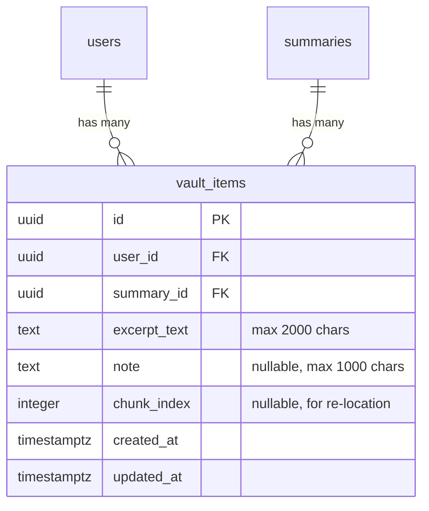

# feat: Add Vault — Personal Highlight Collection

## Overview

Add a sidebar clipboard where users can highlight text from summaries and save excerpts to a persistent personal collection. The vault is a "highlight reel" — sentences that resonated, saved across meetings. A new "Vault" tab on the dashboard shows the collection in reverse-chronological order grouped by meeting.

**Brainstorm:** [docs/brainstorms/2026-02-18-vault-highlight-collection-brainstorm.md](../brainstorms/2026-02-18-vault-highlight-collection-brainstorm.md)

## Problem Statement / Motivation

Users reading summaries want to save specific sentences that resonate. Today they open Apple Notes or annotate by hand. The vault brings that "notes to self" experience into the product — capture what matters while the context is fresh, build a personal archive over time.

User research signals:

- PM: "I only want to save specific sentences that resonate... I wish I had a text window on the right"
- User: felt the urge to annotate summaries with personal reactions
- User: "the way that it's written is allowing me to explore things more deeply" — reading summaries as self-reflection

## Proposed Solution

### Core Interaction

1. User reads a saved summary
2. Selects text in the summary content
3. A floating "Save to Vault" button appears near the selection
4. Clicking it opens the vault sidebar (right panel, same slot as disabled pearls sidebar)
5. Selected excerpt appears in the sidebar with an optional note field
6. User clicks "Save" → excerpt persists to database
7. Sidebar shows all vault items for this summary (existing + just-saved)

### Collection View

- New "Vault" tab on the dashboard (alongside existing summaries view)
- Reverse-chronological feed grouped by summary title
- Click a vault item → navigates to `/summary/[id]`
- Delete button on each item (with confirmation)
- Inline note editing on saved items

### Scope Boundaries

| In scope (V1)                         | Out of scope                             |
| ------------------------------------- | ---------------------------------------- |
| Text selection → save to vault        | Concept tagging / cross-meeting patterns |
| Optional note per highlight           | Search within vault                      |
| Dashboard "Vault" tab (chronological) | Guest/localStorage support               |
| Navigate from vault item to source    | AI-powered vault insights                |
| Delete vault items                    | Export vault contents                    |
| Edit notes after saving               | Mobile-optimized selection UX            |
| Vault sidebar on saved summaries      | Vault on shared/inline summaries         |

## Technical Approach

### Data Model



- `excerpt_text`: Plain text from `window.getSelection().toString()` (not markdown source)
- `chunk_index`: Which summary chunk the excerpt came from (for approximate scroll-to when navigating back)
- `ON DELETE CASCADE` on both `user_id` and `summary_id` (matches pearls pattern)
- Duplicates allowed (same text, same summary, different notes)

### API Routes

| Route             | Method | Purpose                             | Rate Limit     |
| ----------------- | ------ | ----------------------------------- | -------------- |
| `/api/vault`      | POST   | Save a new vault item               | 60/hr          |
| `/api/vault`      | GET    | List user's vault items (paginated) | No limit (RLS) |
| `/api/vault/[id]` | PATCH  | Update note on a vault item         | 60/hr          |
| `/api/vault/[id]` | DELETE | Delete a vault item                 | 30/hr          |

All routes: auth required, Zod validated, structured logging with request ID.

**Zod schemas:**

```typescript
// POST /api/vault
const CreateVaultItemSchema = z.object({
  summaryId: z.string().uuid(),
  excerptText: z.string().min(1).max(2000),
  note: z.string().max(1000).optional(),
  chunkIndex: z.number().int().min(0).optional(),
});

// PATCH /api/vault/[id]
const UpdateVaultItemSchema = z.object({
  note: z.string().max(1000).nullable(),
});
```

### Component Architecture

**New components:**

| Component          | File                                  | Purpose                                                                     |
| ------------------ | ------------------------------------- | --------------------------------------------------------------------------- |
| `VaultSidebar`     | `src/components/VaultSidebar.tsx`     | Right sidebar showing vault items for current summary + save form           |
| `VaultSavePopover` | `src/components/VaultSavePopover.tsx` | Floating button/popover near text selection                                 |
| `SelectionCapture` | `src/components/SelectionCapture.tsx` | Wrapper that detects text selection via `mouseup` + `window.getSelection()` |
| `VaultDashboard`   | `src/components/VaultDashboard.tsx`   | Dashboard tab content: chronological vault item feed                        |

**Modified components:**

| Component           | File                                    | Change                                                                                               |
| ------------------- | --------------------------------------- | ---------------------------------------------------------------------------------------------------- |
| `SummaryView`       | `src/components/SummaryView.tsx`        | Wrap summary cards with `SelectionCapture`, render `VaultSidebar` instead of disabled pearls sidebar |
| `DashboardClient`   | `src/app/dashboard/DashboardClient.tsx` | Add tab bar (Summaries / Vault), conditionally render vault or summaries content                     |
| Summary detail page | `src/app/summary/[id]/page.tsx`         | Fetch vault items for summary, pass to `SummaryView`                                                 |

**Sidebar state:** The vault sidebar replaces the pearls sidebar slot. Conditional render: if pearls are active, show pearls sidebar; otherwise show vault sidebar. Built as a separate component, not embedded in `PearlsSidebar`.

**Sidebar visibility:** Always visible on saved summaries (shows existing vault items). Expands save form when user makes a text selection.

### Key Design Decisions

| Decision             | Choice                               | Rationale                                                                        |
| -------------------- | ------------------------------------ | -------------------------------------------------------------------------------- |
| Selection mechanism  | Floating button near selection       | Familiar pattern (Medium/Kindle), low friction, no sidebar-first complexity      |
| Excerpt storage      | Plain text, not markdown             | `getSelection().toString()` is simpler and avoids markdown parsing edge cases    |
| Position tracking    | Chunk index only                     | Good enough for "scroll to approximate area" without brittle character offsets   |
| Summary delete       | CASCADE (items vanish)               | Matches pearls pattern. Future: add confirmation dialog mentioning vault items   |
| Dashboard tabs       | URL query param (`?tab=vault`)       | Supports back button, bookmarking, direct linking                                |
| Sidebar architecture | Separate component, same layout slot | Clean separation from pearls, easy to coexist later                              |
| Optimistic saves     | No — server-confirmed                | Vault saves are infrequent and important. Show brief spinner, then success toast |

## Implementation Phases

### Phase 1: Database + Types + API Routes

**Files to create:**

- `supabase/migrations/YYYYMMDDHHMMSS_create_vault_items_table.sql`
- `src/app/api/vault/route.ts` (GET + POST)
- `src/app/api/vault/[id]/route.ts` (PATCH + DELETE)

**Files to modify:**

- `src/lib/supabase/types.ts` — add `vault_items` to `Database`, add `SavedVaultItem` type + `toSavedVaultItem()` converter

**Migration SQL (following pearls pattern):**

```sql
CREATE TABLE vault_items (
  id UUID PRIMARY KEY DEFAULT gen_random_uuid(),
  user_id UUID NOT NULL REFERENCES auth.users(id) ON DELETE CASCADE,
  summary_id UUID NOT NULL REFERENCES summaries(id) ON DELETE CASCADE,
  excerpt_text TEXT NOT NULL,
  note TEXT,
  chunk_index INTEGER,
  created_at TIMESTAMPTZ NOT NULL DEFAULT NOW(),
  updated_at TIMESTAMPTZ NOT NULL DEFAULT NOW()
);

CREATE INDEX vault_items_user_id_idx ON vault_items(user_id);
CREATE INDEX vault_items_summary_id_idx ON vault_items(summary_id);
CREATE INDEX vault_items_created_at_idx ON vault_items(created_at DESC);

ALTER TABLE vault_items ENABLE ROW LEVEL SECURITY;

CREATE POLICY "Users can view own vault items" ON vault_items FOR SELECT
  USING ((SELECT auth.uid()) = user_id);

CREATE POLICY "Users can insert own vault items" ON vault_items FOR INSERT
  WITH CHECK ((SELECT auth.uid()) = user_id);

CREATE POLICY "Users can update own vault items" ON vault_items FOR UPDATE
  USING ((SELECT auth.uid()) = user_id);

CREATE POLICY "Users can delete own vault items" ON vault_items FOR DELETE
  USING ((SELECT auth.uid()) = user_id);
```

**Acceptance criteria:**

- [ ] Migration runs cleanly on `supabase db reset`
- [ ] TypeScript types compile
- [ ] POST /api/vault creates a vault item (test with curl/Postman)
- [ ] GET /api/vault returns paginated vault items for the authenticated user
- [ ] PATCH /api/vault/[id] updates note
- [ ] DELETE /api/vault/[id] removes item
- [ ] All routes have Zod validation, rate limiting, auth checks, structured logging
- [ ] RLS prevents cross-user access

### Phase 2: Vault Sidebar + Text Selection

**Files to create:**

- `src/components/VaultSidebar.tsx`
- `src/components/VaultSavePopover.tsx`
- `src/components/SelectionCapture.tsx`

**Files to modify:**

- `src/components/SummaryView.tsx` — integrate `SelectionCapture` around summary cards, render `VaultSidebar` in sidebar slot
- `src/app/summary/[id]/page.tsx` — fetch vault items for summary, pass as prop

**Text selection flow:**

1. `SelectionCapture` wraps the summary card content area
2. On `mouseup`, checks `window.getSelection().toString()`
3. If non-empty and non-whitespace, shows `VaultSavePopover` positioned near the selection (`getRangeAt(0).getBoundingClientRect()`)
4. `VaultSavePopover` has a "Save to Vault" button → opens note field in the sidebar
5. Sidebar shows the excerpt, optional note textarea, and "Save" button
6. On save: POST to `/api/vault`, add to local state, show success toast
7. `VaultSidebar` also lists existing vault items for this summary (fetched on page load)

**Coexistence with EditableMarkdown:** The `SelectionCapture` only activates when the user is NOT in edit mode on a chunk. The existing `EditableChunk` has an `isEditing` state — selection capture ignores events when any chunk is being edited.

**Sidebar layout:** Same flex layout as current pearls sidebar:

```
<div className="flex flex-col lg:flex-row gap-8">
  {summaryContent}
  <aside className="w-full lg:w-72 xl:w-80 lg:sticky ...">
    <VaultSidebar ... />
  </aside>
</div>
```

**Acceptance criteria:**

- [ ] Selecting text in a saved summary shows a floating "Save to Vault" button
- [ ] Clicking the button opens the vault sidebar with the excerpt pre-filled
- [ ] User can add an optional note and save
- [ ] Saved items appear in the sidebar immediately
- [ ] Existing vault items for the summary load on page open
- [ ] Items show excerpt text, note (if any), and timestamp
- [ ] Delete button on each vault item (with confirmation)
- [ ] Edit note inline on saved items
- [ ] Selection capture does NOT interfere with EditableMarkdown edit mode
- [ ] Vault sidebar hidden on shared summaries (`readOnly` mode)
- [ ] Vault sidebar hidden on inline/unsaved summaries (no `summaryId`)

### Phase 3: Dashboard Vault Tab

**Files to create:**

- `src/components/VaultDashboard.tsx`

**Files to modify:**

- `src/app/dashboard/DashboardClient.tsx` — add tab bar, conditionally render `VaultDashboard`
- `src/app/dashboard/page.tsx` — accept `tab` search param, fetch vault items if tab=vault

**Tab infrastructure:**

- Two tabs: "Summaries" (default) and "Vault"
- URL-driven: `/dashboard?tab=vault`
- Tab bar renders between the header and search/content area
- Vault tab shows count badge

**Vault feed layout:**

- Grouped by summary (title as group header, linked to `/summary/[id]`)
- Within each group: vault items in reverse-chronological order
- Each item shows: excerpt text, note (if any), timestamp, delete button
- Click excerpt → navigate to `/summary/[id]`
- Empty state: onboarding copy explaining how to save highlights
- Pagination: "Load more" button (matching summaries pattern)

**GET /api/vault query:**

```sql
SELECT vi.*, s.title as summary_title
FROM vault_items vi
JOIN summaries s ON vi.summary_id = s.id
WHERE vi.user_id = auth.uid()
ORDER BY vi.created_at DESC
LIMIT 20 OFFSET ?
```

**Acceptance criteria:**

- [ ] Dashboard shows Summaries / Vault tabs
- [ ] Tab state syncs with URL query parameter
- [ ] Vault tab shows items grouped by summary with title headers
- [ ] Summary titles link to `/summary/[id]`
- [ ] Delete button works with confirmation
- [ ] Edit note inline works
- [ ] Empty state shows helpful onboarding copy
- [ ] Pagination via "Load more"
- [ ] Vault tab shows item count badge

## Success Metrics

- Users who try the vault feature (save at least 1 highlight)
- Vault items per user over time (growing = sticky)
- Return visits to vault tab (viewing collection = value)

## Dependencies & Risks

| Risk                                                 | Mitigation                                                                                  |
| ---------------------------------------------------- | ------------------------------------------------------------------------------------------- |
| Text selection UX is fiddly across browsers          | Start with desktop-only, test Chrome/Safari/Firefox. Mobile is out of V1 scope              |
| Conflict with EditableMarkdown edit mode             | Guard selection capture behind `isEditing` state check                                      |
| Pearls sidebar re-enablement creates layout conflict | Built as separate component in same slot — conditional render keeps them decoupled          |
| Cascade delete loses vault items silently            | Acceptable for V1. Future: add confirmation dialog on summary delete mentioning vault items |

## References

- Pearls table migration (template): `supabase/migrations/20260209010000_create_pearls_table.sql`
- Pearls sidebar (pattern): `src/components/PearlsSidebar.tsx`
- API route pattern: `src/app/api/pearls/route.ts`
- SummaryView sidebar layout: `src/components/SummaryView.tsx:847-893`
- Dashboard client: `src/app/dashboard/DashboardClient.tsx`
- Error handling checklist: `docs/solutions/runtime-errors/pr-31-error-handling-logging-overhaul.md`
- TypeScript types: `src/lib/supabase/types.ts`
